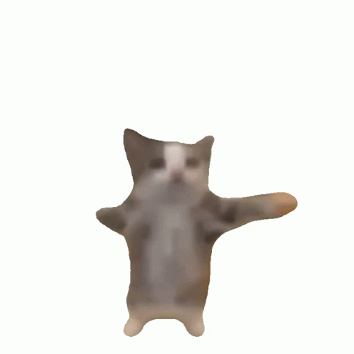

# 🐱 DesktopCat - Always-on-Top Desktop Companion

<p align="center">
  
</p>

<p align="center">
  <b>A delightful, transparent, animated desktop pet that dances on your screen always on top of all windows!</b>
</p>

<p align="center">
  
  
  
</p>

---

## ✨ Features

- **Always on Top**: Floats smoothly above all applications (browsers, IDEs, games, taskbar).
- **Smart Background Cutout**: Automatically removes white backgrounds and dark vignettes so cats blend seamlessly onto your wallpaper with true alpha transparency.
- **Cross-Platform**: Works natively on **Linux** (X11 & Wayland / KDE / GNOME / XFCE) and **Windows**.
- **5 Iconic Cat Memes Included**:
  - 🐱 **Dancing Cat (Happy Cat)**
  - 🐱 **Maxwell Cat**
  - 🐱 **Pop Cat**
  - 🐱 **Clapping Cat (Oiia Oiia)**
  - 🐱 **Chipi Chipi Cat**
- **Interactive Controls**:
  - **Drag & Drop**: Move the cat anywhere with your mouse.
  - **Snap to Corner**: Double-click to snap right above the taskbar/panel in the bottom-right corner.
  - **Dynamic Scaling**: Scroll your mouse wheel to zoom the cat in or out.
  - **Lock Position**: Lock the cat in place so it won't move accidentally while clicking.
- **System Tray Integration**: Full controls accessible from the notification tray near the clock (AppIndicator on Linux / System Tray on Windows).
- **Autostart Support**: Easily toggle launch on boot (XDG Autostart on Linux, Registry on Windows).
- **Extensible**: Simply drop any `.gif` files into the `gif/` folder and they appear automatically in the menu!

---

## 🐧 Linux Quick Start

### Pre-built Portable Package
1. Download **`DesktopCat-v1.1.0-linux.tar.gz`** from the **Releases** tab.
2. Extract the archive:
   ```bash
   tar -xzf DesktopCat-v1.1.0-linux.tar.gz
   cd DesktopCat
   ```
3. Run setup & launch:
   ```bash
   ./setup.sh
   ./start.sh
   ```

### Running from Source / Repository
1. Prerequisites (Python 3.10+, GTK3, Cairo):
   - **Debian / Ubuntu / Mint**: `sudo apt install python3-gi python3-gi-cairo gir1.2-gtk-3.0 gir1.2-appindicator3-0.1 python3-pil`
   - **Fedora / RHEL**: `sudo dnf install python3-gobject gtk3 libappindicator-gtk3 python3-pillow`
   - **Arch Linux / Manjaro**: `sudo pacman -S python-gobject gtk3 libappindicator-gtk3 python-pillow`
2. Run setup:
   ```bash
   ./setup.sh
   ```
3. Launch:
   ```bash
   ./start.sh
   ```
4. Stop:
   ```bash
   ./stop.sh
   ```

---

## 🪟 Windows Quick Start

### Pre-built Executable
1. Download the latest release from the **Releases** tab (or check the `dist/DesktopCat_Release` folder).
2. Run **`DesktopCat.exe`**.

### Running from Source
1. Install dependencies:
   ```bash
   setup.bat
   ```
2. Launch:
   ```bash
   start.bat
   ```
3. To stop:
   ```bash
   stop.bat
   ```

---

## 🔨 Building Standalone Executable (.exe on Windows)

You can compile the project into a single portable `.exe` file using PyInstaller on Windows:

1. Double-click **`build.bat`**  
   *(or run `python -m PyInstaller --noconfirm --windowed --onefile --name "DesktopCat" --icon "app_icon.ico" --add-data "gif;gif" --add-data "app_icon.ico;." cat_overlay.pyw`)*
2. The compiled executable will be located in **`dist/DesktopCat.exe`**.

---

## 🎮 Controls Summary

| Action | Control |
|---|---|
| **Move Cat** | Left Click + Drag |
| **Snap to Corner** | Double Click Left Mouse Button |
| **Resize** | Mouse Wheel Up / Down |
| **Context Menu** | Right Click on Cat or Tray Icon |
| **Lock / Unlock** | Right Click ➔ `🔒 Lock in Place` |
| **Switch Cat** | Right Click ➔ `🐱 Select Cat` |
| **Add Custom GIFs** | Right Click ➔ `📂 Open GIF Folder...` |
| **Autostart** | Right Click ➔ `🚀 Start with System` |
| **Exit** | Right Click ➔ `❌ Exit` |

---

## 📁 Adding Custom GIFs

Drop any `.gif` files into the `gif/` directory. The application scans the folder in real time and adds them straight into the **Select Cat** menu!

---

## 📄 License

This project is licensed under the [MIT License](LICENSE).
